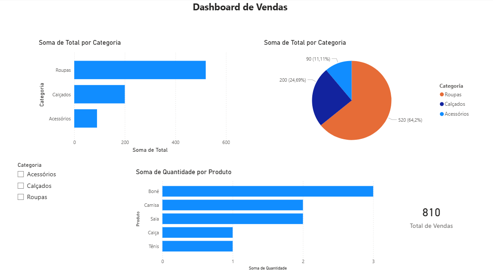

# 📊 Dashboard de Vendas com Power BI

## 📌 Sobre o projeto
Este projeto foi desenvolvido com o objetivo de praticar análise de dados e visualização utilizando Power BI.

## 🎯 Objetivo
Criar um dashboard interativo para analisar dados de vendas e extrair insights relevantes.

## 📊 Análises realizadas
- Total de vendas por categoria
- Produto mais vendido
- Participação de cada categoria nas vendas
- Filtro interativo por categoria

## 🛠️ Ferramentas utilizadas
- Power BI
- Excel / Google Sheets

## 📸 Dashboard

## 🚀 Aprendizados
Neste projeto, pratiquei:
- Criação de dashboards interativos
- Uso de gráficos (barras, pizza)
- Filtros (segmentação de dados)
- Organização visual de informações

## 📁 Como usar
1. Baixe o arquivo `.pbix`
2. Abra no Power BI Desktop
3. Interaja com os filtros e gráficos

---
